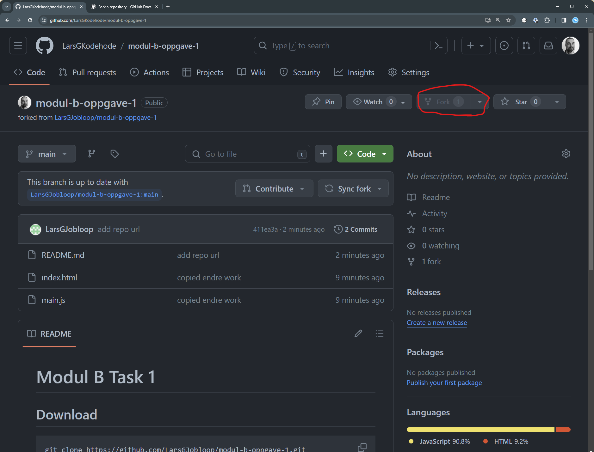
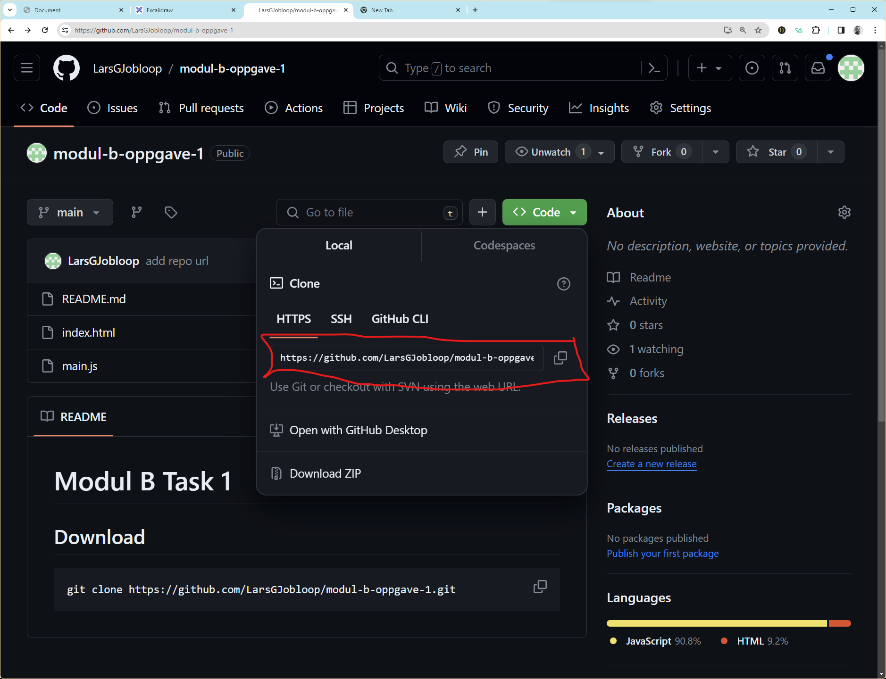

# Modul B Task 1

## Download

1. Fork the repository from mine to your GitHub Account
  

2. Update name and description to anything you want

3. Clone the repo to your machine
  ```shell
  git clone <your-new-repo-url>
  ```
  

4. Do the tasks

5. Push changes to the GitHub Repository
  ```shell
  git push
  ```

6. Submit work to [Google Classroom](https://classroom.google.com/)
